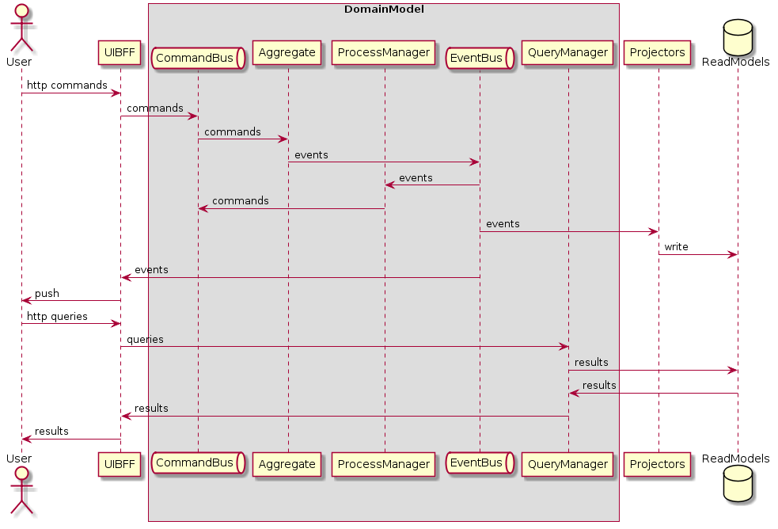
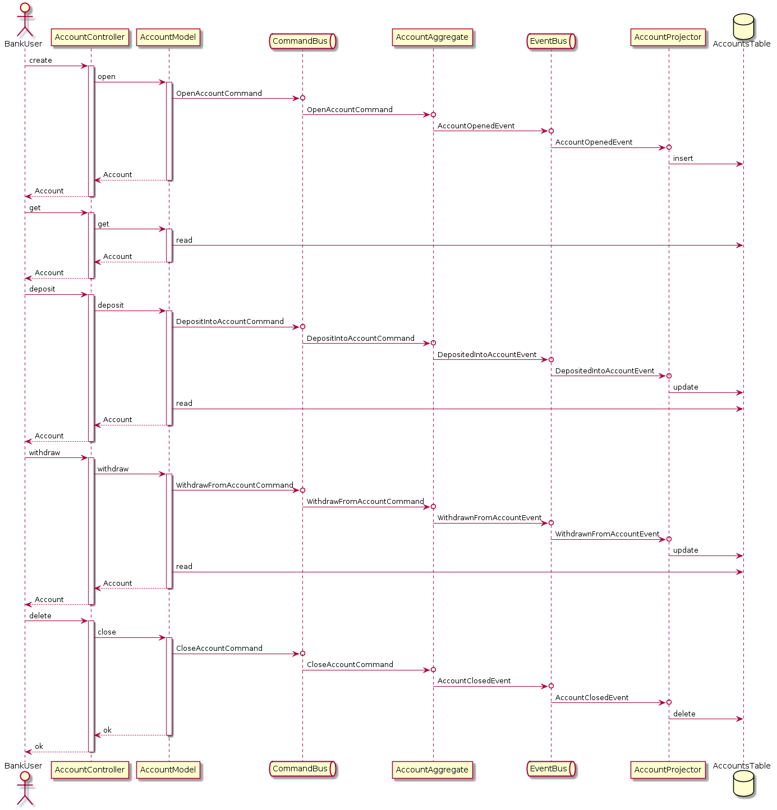
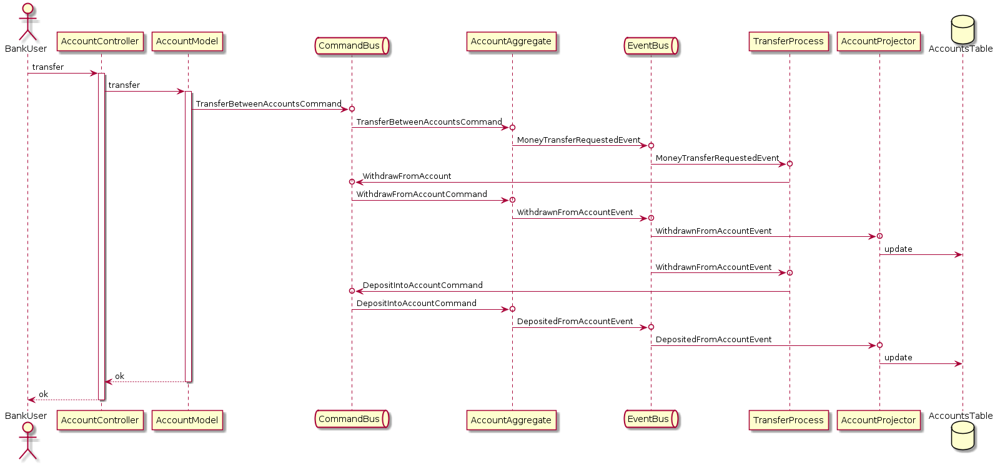

# The bank example

## Getting started

To make this work you need to ...

* install and start postgres (and create/configure the `postgres` user (with a `postgres` password))
* run `mix deps.get`
* run `MIX_ENV=test && mix ecto.setup`
* run `MIX_ENV=dev && mix ecto.setup`
* run `MIX_ENV=dev && mix event_store.create && mix event_store.init`
* run the tests with `mix test`
* run the phoenix server with `mix phx.server`
* test a full lifecycle by running `./scripts/full.sh`
* test a transfer by running `./scripts/transfer.sh`

## Diagrams

Note: The diagrams below show how the system behaves with `strong` consistency being the default (see `config/config.exs`)

### CQRS (in general)

### Full Lifecycle

### Transfer

