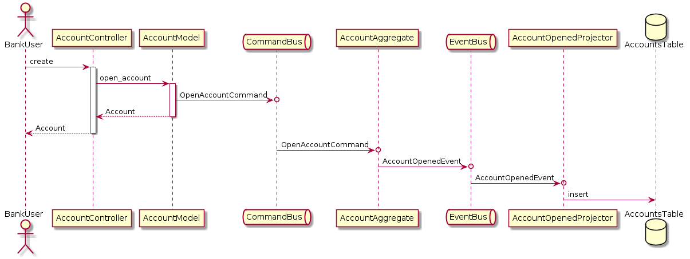

# The bank example

## Getting started

To make this work you need to ...

* install and start postgres (and create/configure the postgres user (with a password `postgres`))
  * Note: My postgres server runs on port 5433 (if yours runs on 5432, you need to change `config/dev.exs` and `config/test.exs`)
* run `mix deps.get`
* run `MIX_ENV=test && mix ecto.setup`
* run `MIX_ENV=dev && mix ecto.setup`
* run the tests with `mix test`
* run the phoenix server with `mix phx.server`
* create an account by running `./scripts/open-account.sh`

## Diagrams

### CQRS (in general)

### Open Account

